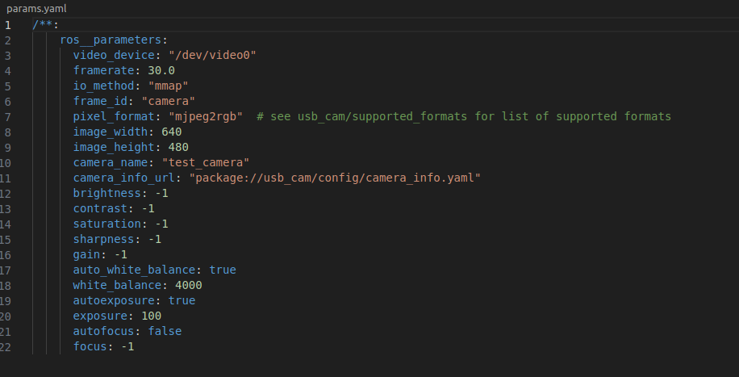

# Camera

## Driver 

Le pilote est déjà disponible dans votre distribution ROS2 Humble. Pas besoin de télécharger un package depuis un site, il vous suffit simplement de suivre les différentes instructions.

1/ Vérification et installation de l'API Linux :

Installation de V4L :

```sudo apt-get install v4l-utils```

Périphériques vidéo disponibles :

```v4l2-ctl --list-devices```

Assurez-vous que la caméra est présente dans la liste.

2/ Installation du pilote :

Pour installer le pilote, exécutez simplement la commande suivante :

"sudo apt-get install ros-humble-usb-cam"

Les nœuds capteurs se trouvent dans le chemin suivant : ```/opt/ros/humble/share/usb_cam```.

3/ Modification des paramètres :

Avant de lancer la caméra, il est nécessaire de modifier les paramètres par défaut du pilote, qui se trouvent dans le fichier usb_cam/config/params.yaml. Ce fichier comprend un ensemble de paramètres, dont le format pris en charge par la caméra. Choisissez le format ```yuv2rgb``` à la place de ```mjpeg2rgb```.



4/ Lancement du pilote :

Pour lancer le package ROS, exécutez simplement la commande suivante :

```ros2 launch usb_cam demo_launch.py```

Si tout se passe bien, une fenêtre s'ouvre avec le retour de la caméra.
